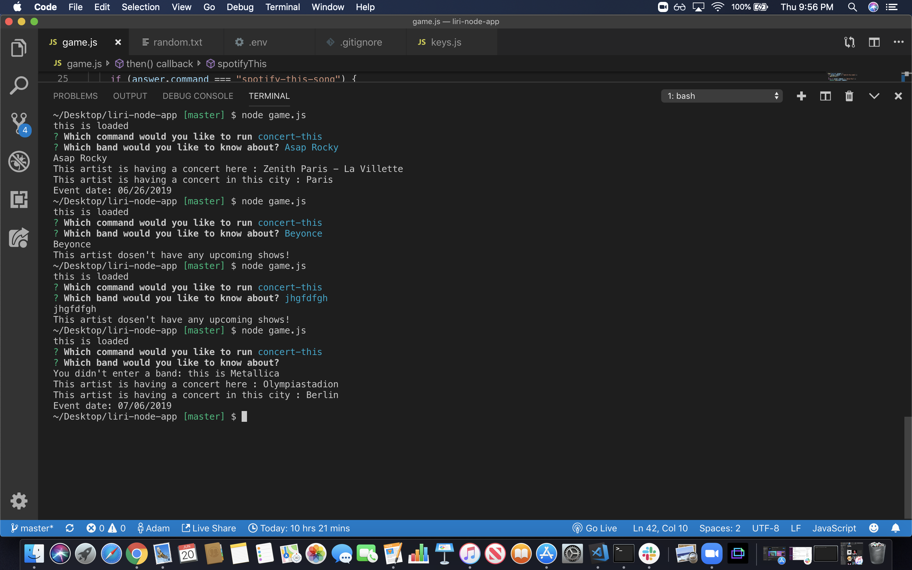
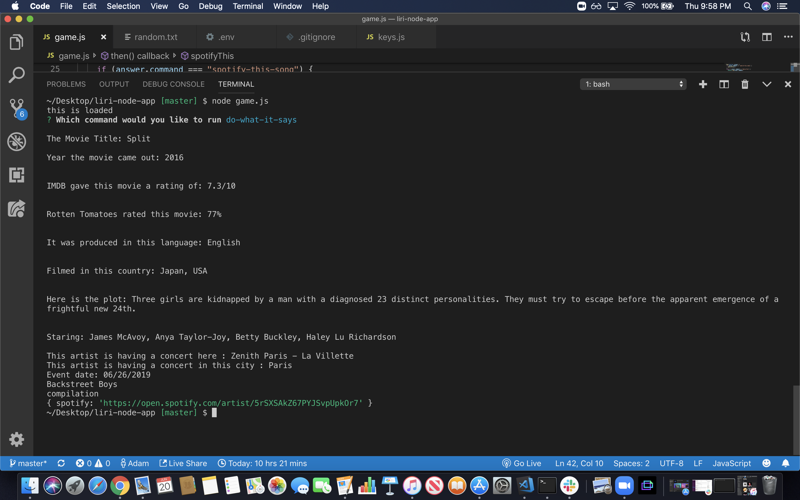
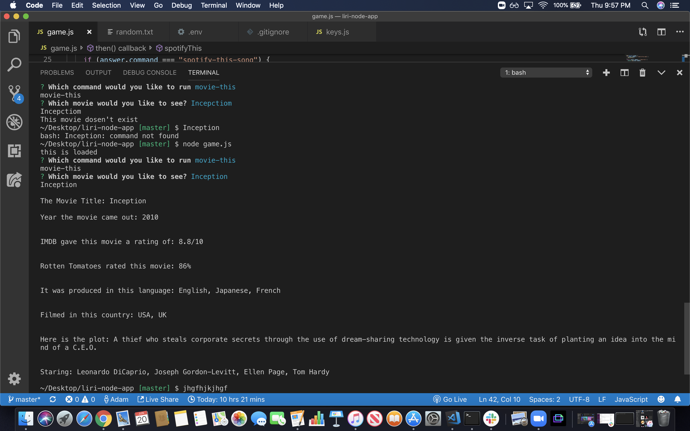
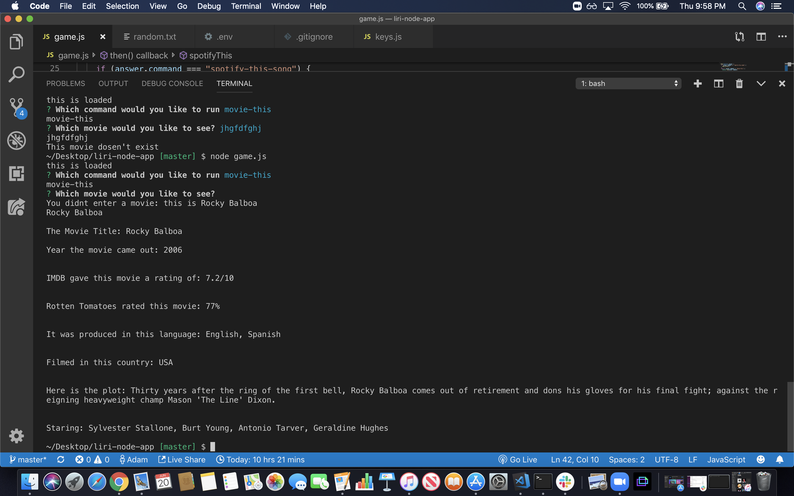
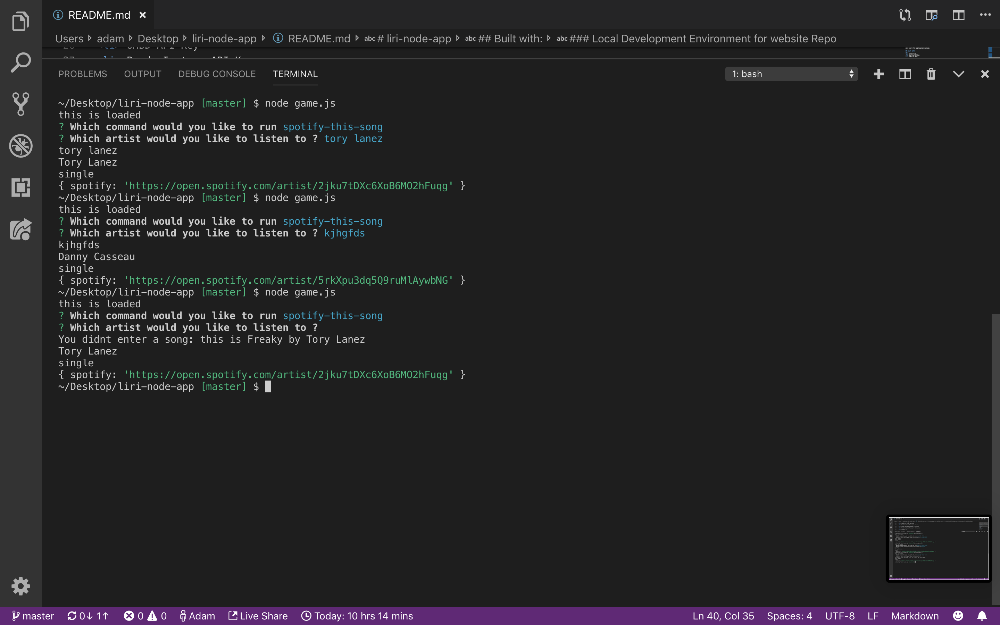

# liri-node-app 
Liri-node-app or Language Interpretation and Recognition Interface is a <a href="https://developer.mozilla.org/en-US/docs/Mozilla/Command_Line_Options">CLI</a> app. Meaning you'll be able to see what it does in the images below! I will provide an overview here:
We begin by calling the the Node < file name > this will bring up the Inquirer prompt to choose between the 4 options: 
<ol>
<li> Movie-This
<li> Concert-This
<li> Spotify-this-song
<li> Do-what-it-says
<ol>
Depending on the choice we are calling a function that will issue another prompt before initiating. We ask the user what movie, artist or song hey would like to search for. For the first three commands we take the users request and plug it into the request url and send a request to get information through axios. Since we are communicating with the server and not the browser we need to use <a href="https://www.npmjs.com/package/axios">axios</a>  to get make the API call. The data will return in the form of a JSON object <a href="https://developer.mozilla.org/en-US/docs/Learn/JavaScript/Objects/JSON">JSON object</a> 
We will parse through the data and pull the deeply nested information to the terminal. Lastly for the Movie-This
Concert-This & Spotify-this-song command we set up conditional statements to catch errors and edge cases. If the user does not type in a request, we direct them to an automatic response. Else if the user types in a request that pulls undefined data an error, gibberish, since the request has already been made we inform the user the the search did not bring back any information instead of displaying the error response. 

Additionally for the command Do-what-it-says we are still sending a request. But this time we are reading from a text file and pulling what is in the text file. Specifically we are splicing an array text into individual indices pulling the data, and placing this information into the url and making the request. 

## Perquisites
You need to git pull this repo to your desktop using git clone and the git hub url. This application will need to be open in a text editor or ran in the terminal.You will need to install the Node package managers Axios & DotEnv. We have also hidden the Spotify API Id & Secret. You can get yours for free by signing up at  <a href="https://developer.spotify.com/dashboard/login">Spotify for Developers!</a>

## Running Tests/Instructions
Open the file in your text editor or terminal. Install the node packages listed below and apply for a Spotify API ID & Secret. As well as a OBMD API KEY & Bands in town API key. Move into the file you have saved the file in and type node < the filename >.js. This will start the application running.

## Built with:
<ol>
<li> Javascript
<li> Spotify API Key
<li> OMBD API Key
<li> Bands In town API Key
<li> Node Package Manager - Axios 
<li> Node Package Manager - DotEnv 
<li> Node Package Manager - Inquirer 
<li> Moment.js
</ol>

### Local Development Environment for website Repo
The following will get up and running locally.

Author
Adam Lehrer

